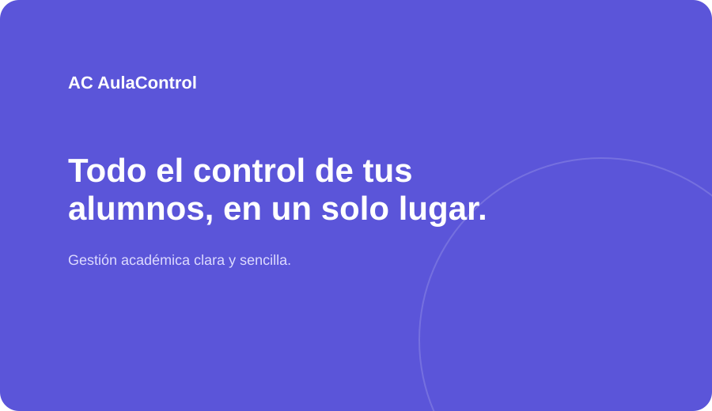
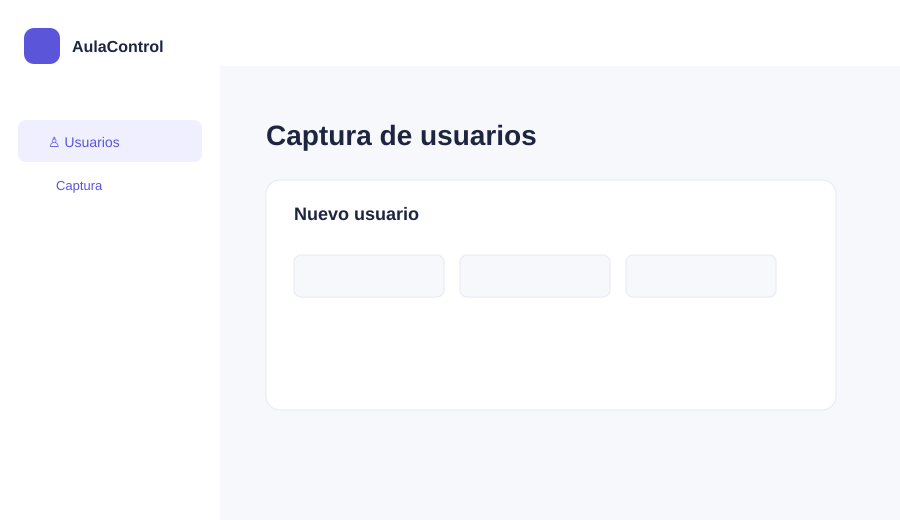

# AulaControl

## Portada

**AulaControl — sistema de gestión académica**
Proyecto web de la actividad 5.

**Integrantes del equipo:**

- Canseco Reyes Juan Carlos
- Navarro Vazquez Jonathan de Jesus
- Perez Cruz Maria Isabel

**Descripción breve:** AulaControl permite validar un acceso, entrar a un panel de gestión y capturar usuarios y alumnos desde una interfaz sencilla y responsive. No requiere backend: la sesión se simula con `localStorage`.

---

## Tabla de contenido

1. [Tecnologías y framework CSS](#tecnologías-y-framework-css)
2. [Estructura del proyecto](#estructura-del-proyecto)
3. [Flujo de la aplicación](#flujo-de-la-aplicación)
4. [Métodos principales](#métodos-principales)
5. [Proceso de creación](#proceso-de-creación)
6. [Capturas del flujo completo](#capturas-del-flujo-completo)
7. [Ejecución y GitHub Pages](#ejecución-y-github-pages)
8. [Participación del equipo](#participación-del-equipo)

---

## Tecnologías y framework CSS

- HTML5, CSS3 y JavaScript.
- **Bootstrap 5.3** como único framework CSS, cargado desde CDN. De Bootstrap se usan la cuadrícula, el navbar, el dropdown, el componente Collapse del sidebar y el componente Modal.
- `localStorage` para simular la sesión sin backend.

## Estructura del proyecto

```
actividad5/
├── .github/workflows/   # Publicación en GitHub Pages
├── css/                 # Estilos propios
├── img/                 # Capturas e imágenes del README
├── js/
│   ├── utileria.js      # Librería de validaciones
│   ├── login.js         # Lógica del inicio de sesión
│   └── app.js           # Lógica del panel (sesión, navbar, formularios)
├── login.html           # Pantalla de acceso
├── index.html           # Panel principal
└── README.md
```

## Flujo de la aplicación

1. `login.html` recibe correo y contraseña.
2. `validarCorreo` y `validarPassword`, ubicadas en `js/utileria.js`, validan los datos.
3. Si son correctos, `login.js` guarda un objeto con el correo y un nombre derivado en `localStorage` y redirige a `index.html`.
4. `app.js` verifica que exista la sesión. El nombre y el correo se colocan en el navbar.
5. "Salir del sistema" elimina la sesión y regresa a `login.html`.

```
login.html ──> validarCorreo / validarPassword ──> localStorage (sesión)
                                                        │
                                                        ▼
login.html <── "Salir del sistema" <── index.html (app.js lee la sesión → navbar)
```

### ¿Cómo se pasa el nombre de usuario del login al navbar?

1. En `login.js`, al validar correctamente, se toma la parte del correo anterior a `@` y se transforma en un nombre visual (por ejemplo, `demo@aulacontrol.com` → `Demo`).
2. Se guarda un objeto con el correo y ese nombre mediante `localStorage.setItem`.
3. Al cargar `index.html`, `app.js` lee la sesión con `localStorage.getItem`. Si no existe, redirige a `login.html`.
4. Si existe, escribe el nombre y el correo dentro del dropdown del navbar.

## Métodos principales

| Método | Descripción |
| --- | --- |
| `validarCorreo(correo)` | Verifica el formato del correo. |
| `validarPassword(password)` | Exige una contraseña de mínimo seis caracteres. |
| `validarNumeroControl(numero)` | Exige exactamente seis dígitos. |
| `localStorage.setItem` | Conserva la sesión simulada durante la navegación. |
| `bootstrap.Modal` | Muestra el resultado de la validación de edad. |

La edad se simula con los primeros dos dígitos del número de control. Por ejemplo, `170000` representa 17 años y muestra "menor de edad"; una edad de 18 o más muestra "mayor de edad". Es una regla demostrativa, no una inferencia real de edad.

## Proceso de creación

### 1. Login

Se diseñó una pantalla dividida con identidad visual y un formulario de correo y contraseña. Las validaciones se escribieron en `js/utileria.js` para poder reutilizarlas en otros formularios, y `login.js` se encarga de guardar la sesión y redirigir.



### 2. Sidebar

Se añadió un menú lateral responsive con botón hamburguesa. La opción **Usuarios** usa el componente Collapse de Bootstrap para desplegar **Captura**.



### 3. Navbar y usuario

El usuario se obtiene del correo usado en login. Se transforma la parte anterior a `@` en un nombre visual y se muestra junto con su correo en el dropdown del navbar. Desde ese mismo menú se cierra la sesión.

### 4. Número de control y modal

El formulario de usuario reutiliza las validaciones de la librería. El formulario de alumno acepta únicamente seis dígitos en el número de control y abre un modal con el resultado de la regla de edad. Los únicos botones son los de entrar, abrir/cerrar menús, guardar usuario, registrar alumno, cerrar sesión y aceptar el modal.


## Capturas del flujo completo

Recorrido de la aplicación funcionando, de principio a fin:

| Paso | Captura |
| --- | --- |
| 1. Acceso con correo y contraseña |  |
| 2. Panel con sidebar y navbar con el usuario |  |
| 3. Registro de alumno y modal de edad |  |

## Ejecución y GitHub Pages

Abre `login.html` con un servidor estático (por ejemplo, Live Server) o publica la raíz del repositorio en GitHub Pages. Para probar:

- Correo: `demo@aulacontrol.com`
- Contraseña: `123456`

No se requiere backend.